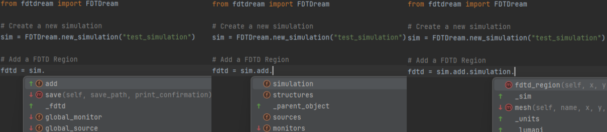
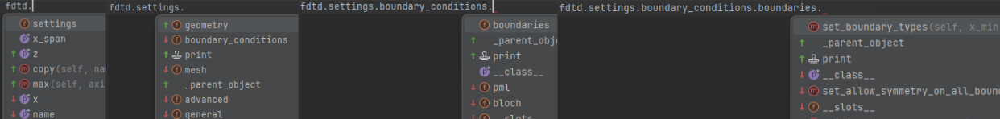

# FDTDream

> This README and user-guides are not quite finished.

FDTDream is a Python package designed to streamline the process of working with Lumerical FDTD simulations. Built on Lumerical's native Python API, FDTDream simplifies the creation and modification of simulation objects with a more intuitive and manageable syntax. Unlike the native API, FDTDream offers comprehensive auto-completion, well-structured documentation, and additional custom objects like lattices and regular polygons, making it significantly easier to use.

---

## Contents
### [Installation](#installation)
### [Auto-completion and documentation](#autocompletion-and-documentation)
### [Example usage](#example-usage)


## User-Guides
### [Getting Started](User_Manual/Getting%20started)
#### [Creating Simulations](User_Manual/Getting%20started/Creating_simulations.md)
#### [Object Basics](User_Manual/Getting%20started/Object_basics.md)
#### [Geometry Module](User_Manual/Getting%20started/Geometry%20module.md)
### [Structures](User_Manual/Structures)
#### [Material module](User_Manual/Structures/Material%20module.md)
#### [Rotation module](User_Manual/Structures/Material%20module.md)
#### [Structure Basics](User_Manual/Structures/Structure%20basics.md)

---
## Installation  

To use FDTDream, you must have **Lumerical FDTD** installed on your computer, along with a valid license and the correct path to Lumerical's Python API.  

### 1. Install FDTDream  
Run the following command:  
```cmd
pip install fdtdream
```

### 2. Set the Lumerical API path
To permanently set the location of Lumerical’s lumapi.py file, run:
```python
from FDTDream import set_lumapi_location

set_lumapi_location("path_to_lumapi.py")
```
This needs to be done only once, as it updates the default search path for lumapi.py. Unless you reinstall or update FDTDream, no further action is required.

To get the currently set path, use:
```python
from FDTDream import get_lumapi_location

print(get_lumapi_location())
```

### Default *lumapi.py* location
By default, lumapi.py is typically found at:
```cmd
C:\Program Files\Lumerical\v241\api\python\lumapi.py
```
> Note: The v241 folder name may vary depending on your Lumerical installation version.

---
## Autocompletion and documentation
One of FDTDream's key features is its powerful auto-completion and structured documentation. Lumerical's FDTD desktop application has a complex interface with deeply nested menus and options, which can be difficult to translate into a pure Python workflow. FDTDream addresses this challenge by organizing simulation objects into well-structured submodules that closely mirror the original application's hierarchy. This design makes navigation intuitive and enables users to explore available options efficiently. To facilitate this, FDTDream leverages auto-completion, allowing users to "scroll" through available properties and methods instead of memorizing their locations.

For instance, adding an FDTD Region and modifying its boundary conditions is as simple as:

```python
from fdtdream import FDTDream

# Create a new simulation
sim = FDTDream.new_simulation("test_simulation")

# Add an FDTD Region
fdtd = sim.add._parent.fdtd_region()
fdtd.settings.boundary_conditions.boundaries.set_boundary_types(
    x_min="anti_symmetric", x_max="anti-symmetric",
    y_min="symmetric", y_max="symmetric"
)
```

While this structure may seem extensive, auto-completion eliminates the need to remember exact method locations. Additionally, all methods come with clear documentation, including input variables, types, and explanations of how each setting affects the simulation.

In practice, auto-completion hints will appear as follows:





---

## Example usage:

> TBD


