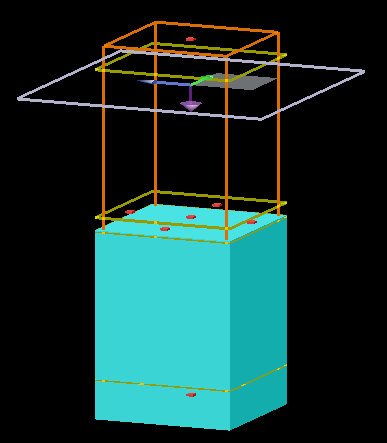
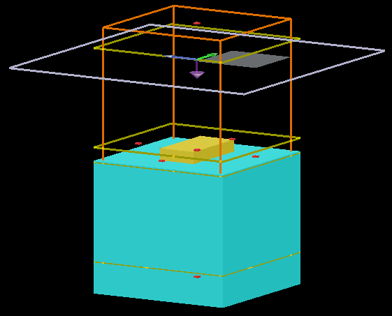
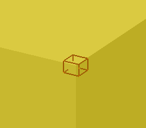
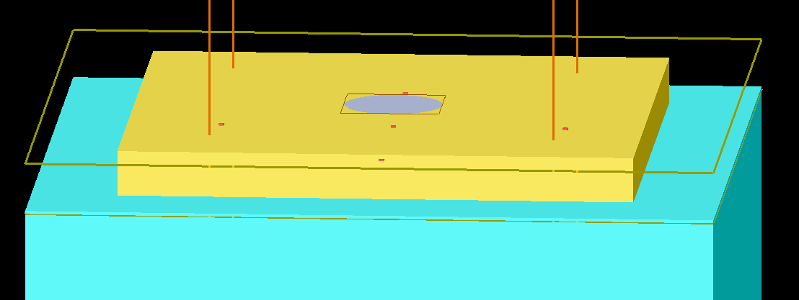
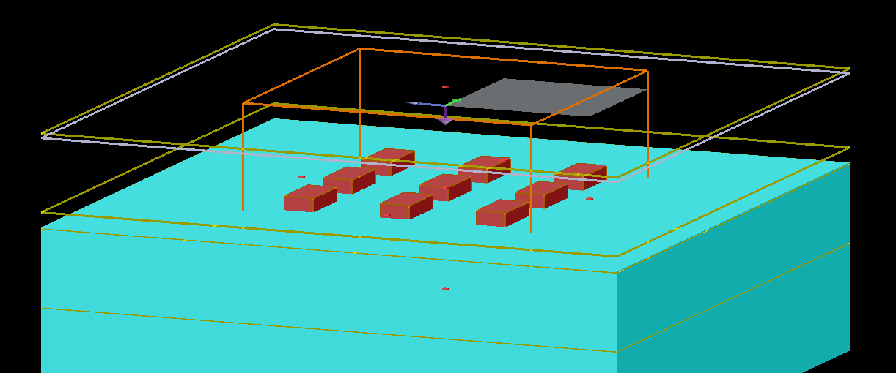
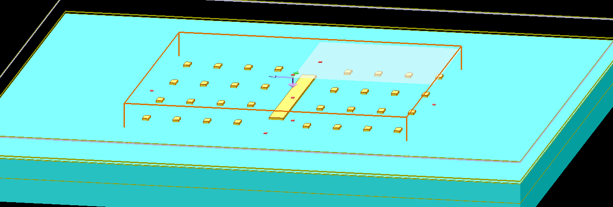
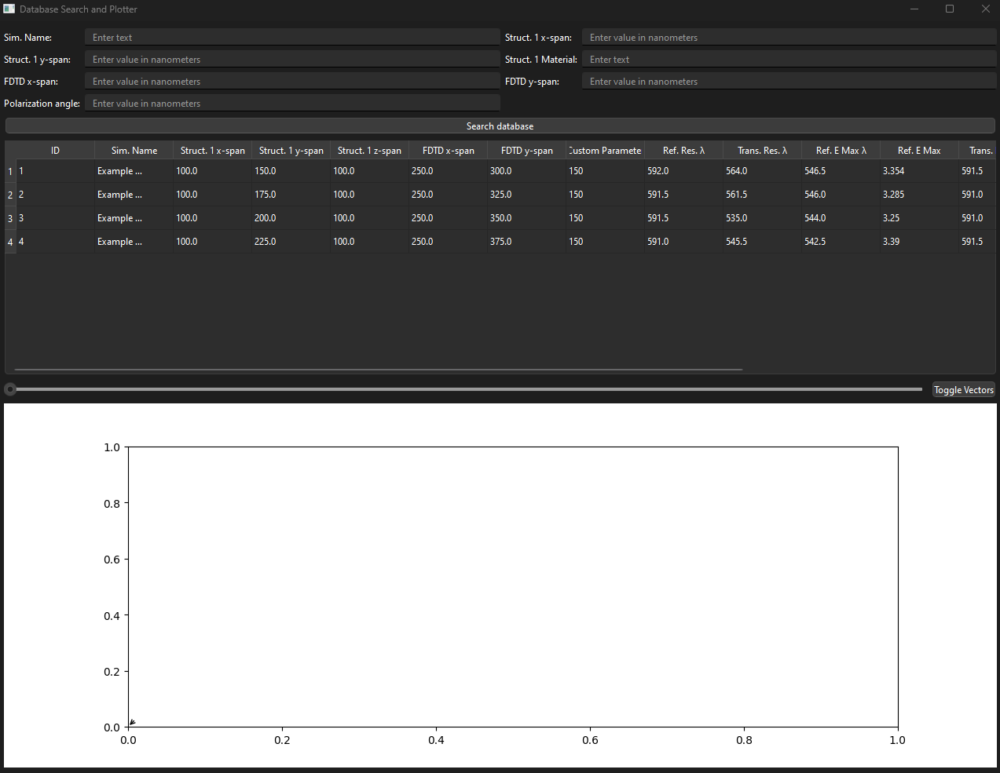
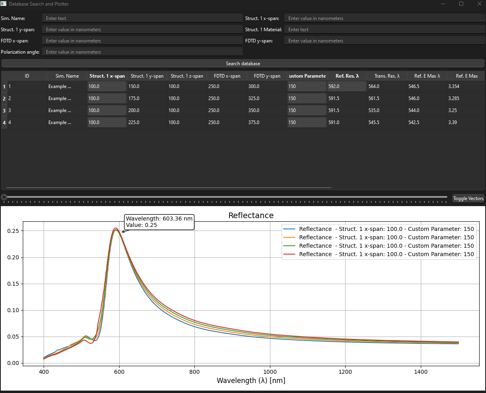

# FDTDream

**FDTDream** is a Python framework for creating simulation geometries in Lumerical FDTD, specifically designed for thin 
film applications. The framework includes a custom database where extracted simulation results are saved for easy access 
and analysis.

## Prerequisites

- A valid license for **Lumerical FDTD**.
- **FDTD** installed on your computer.
- Python packages listed in `requisites.txt` installed.
- Correctly configured path to the **Lumerical Python API** (`lumapi.py`). This is usually found in a default directory, 
but you may need to update the path if the code does not work.

## Initial Setup

1. **Verify lumapi.py Import:**

    \
    Ensure that you are importing `lumapi.py` from the correct directory. In the `Simulation.py` file, you will find the following code snippet:

    ```python
    # Import the Lumerical Python API
    import importlib.util 
    spec_win = importlib.util.spec_from_file_location(
        name='lumapi', 
        location=r"C:\Program Files\Lumerical\v241\api\python\lumapi.py"
    )
    lumapi = importlib.util.module_from_spec(spec_win)
    spec_win.loader.exec_module(lumapi)
    ```

    If you can't run the code initially, Your lumapi.py file is probably located elsewhere. With different FDTD releases, the \v241\ subfolder could be
    named differently, so try locating Your lumapi.py file and change the location variable in the code snippet above.


2. **Install required python packages:**\
    \
    Ensure that you have the required Python packages installed. From the Python console in you IDE you should just be able to run the command:
    ```
    pip install requirements.txt
    ```
    which will install all of them at once. If this doesn't work, you can run a **pip install** command for each one of the packages in the requirements.txt
    file separately in the python console.

## Importing modules

First you need to import the SimulationBase and DatabaseViewer Modules. 
```python
# Import the SimulationBase module
from Simulation import SimulationBase
    
# Import the DatabaseViewer module
from DatabaseViewer import DatabaseViewer
```

# Creating a simulation enviroment

You can create a default simulation enviroment just by constructing an object from the SimulationBase class:

```python
simulation = SimulationBase(
    simulation_name="Example Simulation",  # The name of the simulation save file, also the name in the database
    folder_name="Example Simulations",  # Folder where the simulation file will be saved; created if it doesn't exist
    db_name="Example Database",  # Name of the database for saving results; created if it doesn't exist
    hide=False  # Optional parameter (default=True); hides FDTD if True, runs in the background
)
```
Upon initialization, a new base simulation environment is created.
This includes setting boundary symmetry for the FDTD region, adding six monitors,
a source, and a substrate with its top surface at z=0.
The environment is saved in the /Base Environment directory for future use.
If a base environment file is found, subsequent simulations will build on it
instead of starting from scratch.

The base simulation environment created will look like this.
To view the file in Lumerical, it will be located at:
"/Simulations/Example Simulations/Example simulation.fsp".


    
# Creating basic structures
Now, let's add a simple structure — a 100x100x100 nm rectangle on top of the substrate.
This can be done using the addrect() method.
```python
simulation.addrect(
    structure_type_id="Example Rectangle",  # Identifier for this type of structure
    hole_in=None,  # Set if this structure is an etch in another structure
    spans=(100, 100, 100),  # Dimensions of the structure (x, y, z) in nm
    position=(0, 0, 100 / 2),  # Position of the center of the structure (x, y, z), here on top of the substrate
    material="Au (Gold) - Johnson and Christy",  # Material for the structure
    edge_mesh_size=None,  # Optional: mesh cube size at rectangle corners (disabled by default)
    edge_mesh_stepsize=None,  # Optional: stepsize for mesh cubes at the corners
    bulk_mesh_enabled=True  # Enable the mesh that surrounds this structure (default=True). 
)
simulation.save()
```
The **structure_type_id**-parameter is the identifier for this structure, and is later used when changing parameters like
size and position. It can be whatever, but if you want the parameters of the structure to be saved and displayed in the
database, it has to be 1, 2, or 3 as an integer.

If you'd like to view the updated simulation geometry, the save() method
will save the file in the same location as before. Now the simulation looks like this:



If you choose to add edge meshing cubes to the corners of the structure, these will look like this:



The mesh stepsize will extend along all axes, centered at the cube.

# Thin film with etched circular hole

The FDTD region is automatically centered between the substrate and the tallest structure.
By default, it is centered at z=50 nm, suitable for structures that are 100 nm thick.
To simulate a 150 nm thick gold film with an etched circular hole,
we need to adjust the film thickness. 

Let's create a new simulation,
this time running FDTD in the background (hide=True).

```python
simulation_2 = SimulationBase(
    simulation_name="Example Simulation 2",
    folder_name="Example Simulations",
    db_name="Example Database",
    hide=True
)

# Fetch the spans of the FDTD region in the xy-plane
FDTD_xspan, FDTD_yspan, FDTD_zspan = simulation_2.get_FDTD_spans()

# Add a 150 nm thick gold film
simulation_2.addrect(
    structure_type_id="Gold Thin Film",
    hole_in=None,
    spans=(FDTD_xspan * 1.5, FDTD_yspan * 1.5, 150),  # Extend the film slightly beyond the FDTD region, z-span is 150 nm
    position=(0, 0, 150 / 2),  # Center the film in the xy-plane, position it on the substrate
    material="Au (Gold) - Johnson and Christy",
    bulk_mesh_enabled=False  # Disable bulk mesh for the film, focusing on the etched hole
)

# Adjust the FDTD region and monitor positions based on the film thickness
simulation_2.define_film_thickness(thickness=150)

# Add a circular etch into the gold thin film
simulation_2.addcircle(
    structure_type_id=1,  # Save hole parameters to the database
    hole_in="Gold Thin Film",  # This is an etched hole in the gold thin film
    spans=(50, 50, 150),  # Radius in x, radius in y, thickness (z)
    position=(0, 0, 150 / 2),  # Center the hole and make it extend through the film
    material="etch",
    bulk_mesh_enabled=True  # Enable bulk mesh around the hole (default=True)
)

simulation_2.save()
```
The updated simulation will look like this:




# Creating structure grids
Now, let’s create a grid of structures.
We will use a material with data for wavelengths between 400 and 1000 nm,
and adjust the simulation to this wavelength range. The set_global_wavelength_range() method will automatically 
adjust the FDTD-region z-span and position along with the positions of the source and monitors.
The structure grid is automatically created using the **create_structure_grid()** method, and each of the structures
are automatically placed on top of the substrate.

```python
# Create a new simulation
simulation_3 = SimulationBase(
    simulation_name="Example Simulation 3",
    folder_name="Example Simulations",
    db_name="Example Database"
)

# Set the global wavelength range
simulation_3.set_global_wavelength_range(
    wavelength_start=400,  # Minimum wavelength
    wavelength_stop=1000,  # Maximum wavelength
    frequency_points=1000  # Number of sample points for this range
)

# Set new FDTD spans, changing only the xy-plane and leaving the z-span unchanged
simulation_3.set_FDTD_spans((1000, 1000, None))

# Fetch boundary coordinates of the FDTD region using the get_FDTD_min_max() method.
# This returns a tuple with 3 tuples, each containing the min and max coordinate.
FDTD_x_min_max, FDTD_y_min_max, FDTD_z_min_max = simulation_3.get_FDTD_min_max()
FDTD_x_min, FDTD_x_max = FDTD_x_min_max
FDTD_y_min, FDTD_y_max = FDTD_y_min_max

# Create a grid of structures
simulation_3.create_structure_grid(
    structure_type_id=1,  # This will be the identifier for each of the structure in the grid
    shape="rect",  # Will produce rectangles (bars). Can also use 'circle'
    structure_spans=(100, 200, 150),  # The dimensions of each of the structures in the grid
    structure_material="PZT",  # Material of each of the structures in the grid.
    hole_in=None,  # The structures in the grid are not holes in another structure.
    min_max_x=(FDTD_x_min, FDTD_x_max),  # Grid boundaries in the x-direction
    min_max_y=(FDTD_y_min, FDTD_y_max),  # Grid boundaries in the y-direction
    num_x=3,  # Number of structures along the x-direction
    num_y=3,  # Number of structures along the y-direction
    # Optional parameters. The values here are the default values.
    min_x_solid_boundary=False,  # If the boundary is not the FDTD boundary, set to True.
    max_x_solid_boundary=False,  # This makes the distance to the boundary twice as big.
    min_y_solid_boundary=False,  # This keeps the periodicity constant when the FDTD region is used to create an infinite array.
    max_y_solid_boundary=False,
    edge_mesh_size=None,  # Defaults to None
    edge_mesh_step_size=None,  # Defaults to None
    bulk_mesh_enabled=True  # Defaults to True
)

# Adjust film thickness for proper FDTD placement
simulation_3.define_film_thickness(thickness=150)

# Save the simulation
simulation_3.save()
```

The simulation we've created will look like this:



If you try to create a grid where the number of structures in either direction won't fit inside the boundaries, 
you will get an error code explaining this.

# Creating more complicated structures

Now we'll try to create a structure like the one in the image:



We will add one large rectangle and two grids with smaller rectangles on each side.
The boundaries towards the rectangle in the middle will be 'solid boundaries'. This means that they are not periodic,
and the structures should be placed twice as far from them as for a periodic boundary to maintain constant periodicity.

The code to produce this geometry is as follows:

```python
simulation_4 = SimulationBase(
    simulation_name="Example Simulation 4",
    folder_name="Example Simulations",
    db_name="Example Database"
)

simulation_4.set_FDTD_spans((5000, 5000, None))

# Now we'll add the large rectangle
simulation_4.addrect(
    structure_type_id=1,
    hole_in=None,
    spans=(250, 3000, 150),
    position=(0, 0, 150 / 2),
    material="Au (Gold) - Johnson and Christy",
)

# Remember to define the film thickness, as our rectangle is 150 nm, and the default value is 100 nm
simulation_4.define_film_thickness(thickness=150)

# Now we'll use the get_structure_min_max() method to fetch the x-boundaries of the large rectangle
Rect_x_minmax, _, _ = simulation_4.get_structure_min_max(structure_type_id=1)  # We don't need the y and z, so we use _
Rect_xmin, Rect_xmax = Rect_x_minmax

# Now we'll fetch the FDTD x and y boundaries
FDTD_x_minmax, FDTD_y_minmax, _ = simulation_4.get_FDTD_min_max()
FDTD_xmin, FDTD_xmax = FDTD_x_minmax
FDTD_ymin, FDTD_ymax = FDTD_y_minmax

# Now we have everything we need to create the grids.
# Let's start with the one to the left of the large rectangle.
# Remember that the max x boundary here is the large rectangle, so this should be a solid boundary.
simulation_4.create_structure_grid(
    structure_type_id=2,
    shape="rect",
    structure_spans=(100, 200, 150),
    structure_material="Au (Gold) - Johnson and Christy",
    hole_in=None,
    min_max_x=(FDTD_xmin, Rect_xmin),  # Limit the x boundary to the large rectangle
    min_max_y=(FDTD_ymin, FDTD_ymax),
    num_x=4,
    num_y=4,
    max_x_solid_boundary=True,  # The right boundary is the larger rectangle, so this is a solid boundary
)

# Create the grid to the right of the large rectangle
simulation_4.create_structure_grid(
    structure_type_id=2,
    shape="rect",
    structure_spans=(100, 200, 150),
    structure_material="Au (Gold) - Johnson and Christy",
    hole_in=None,
    min_max_x=(Rect_xmax, FDTD_xmax),  # Limit the x boundary to the large rectangle
    min_max_y=(FDTD_ymin, FDTD_ymax),
    num_x=4,
    num_y=4,
    min_x_solid_boundary=True,  # The left boundary is the larger rectangle, so this is a solid boundary
)


simulation_4.save()
```

The structure created will look excactly like the one from before:


# Running simulations, sweeps, and saving results to the database


In this section, we will explore how to tweak simulation parameters, run simulations, and examine the results.
After executing a simulation, the program fetches the results from FDTD, which can accumulate a significant amount
of data. Typically, results from a single simulation can range from 120 to 300 MB, which is excessive for our purposes.
Most of this data is not particularly interesting.

To optimize storage and readability, the program converts all length-based values from meters to nanometers and
changes all values to 16-bit floating-point numbers instead of the default 64-bit. This reduces the data size by
a factor of four without compromising accuracy since many values in the dataset consist primarily of leading zeroes.
For instance, the program converts 0.000000001 m to 1 nm. This significantly conserves storage space and simplifies
value interpretation.

Additionally, the program fetches the reflection and transmission spectra, along with the near-field monitor vector fields.
The raw data includes vector fields for each wavelength simulated; however, the program filters these to retain only the
vector fields for peaks in the E-field enhancement spectra. The maximum E-field magnitude for each wavelength is calculated
and saved to the database for plotting against wavelength. The vector fields at these peaks are also saved in the database,
allowing for plotting within the database viewer.

Furthermore, the simulation environment includes xz-plane and yz-plane monitors that capture the magnitude of the E-field
and the Poynting vectors. These monitors are disabled by default but can be activated as needed.

Let's create a simple infinite array of gold bars and perform a sweep on the bar lengths while saving the results to the database.

```python
simulation_5 = SimulationBase(
    simulation_name="Example simulation 5",
    folder_name="Example Simulations",
    db_name="Example database"
)

# Define the film thickness
simulation_5.define_film_thickness(thickness=100)

# Define the wavelength range (default: 400 to 1500 nm with 1000 points)
simulation_5.set_global_wavelength_range(400, 1500, 1000)

# Create the gold bar structure
bar_xspan = 100
bar_yspan = 150
bar_zspan = 100
simulation_5.addrect(
    structure_type_id=1,
    hole_in=None,
    spans=(bar_xspan, bar_yspan, bar_zspan),
    position=(0, 0, bar_zspan / 2),
    material="Au (Gold) - Johnson and Christy",
    edge_mesh_size=1,
    edge_mesh_stepsize=3,
    bulk_mesh_enabled=False
)

# Define a separation distance between bars (in nanometers)
separation_distance = 150

# Set the FDTD region to achieve the desired separation distance, keeping the z-span unchanged
simulation_5.set_FDTD_spans((
    bar_xspan + separation_distance,
    bar_yspan + separation_distance,
    None
))

# Sweep the length of the gold bars while maintaining the separation distance
for bar_yspan in range(150, 250, 25):  # Sweep the y-span of the gold bar
    simulation_5.set_structure_spans(
        structure_type_id=1,  # Change the spans of all structures that has this id
        spans=(None, bar_yspan, None)  # Change only the y-span, leaving the x, and z spans unchanged
    )

    # Adjust the FDTD span to keep the separation distance constant
    simulation_5.set_FDTD_spans((None, bar_yspan + separation_distance, None))

    # Set a custom comment and parameter for the simulation result
    comment = ("Simulating a periodic array of gold bars. "
               "Sweeping the gold bar length while keeping the separation distance constant. "
               "The custom parameter is the distance between the borders of each gold bar "
               " in both the x- and y-direction.")
    # Constant separation distance. If this changed for each sweep iteration you could calculate it.
    custom_parameter = separation_distance  

    # Set the simulation comment and custom parameter
    simulation_5.set_simulation_comment(comment=comment, custom_parameter=custom_parameter)

    # Run the simulation and save the results to the database
    simulation_5.run_and_save_to_db()  # Run simulation and save results to database
```

It is not neccesary to add a comment and a custom parameter, but it can be nice. If there is a parameter that doesn't
have a default collumn in the database, you can add the custom parameter and write in the comment what it represents.

Also, it's good practice to allways save the simulation geometry at the point where you would run the simulation
and check the saved simulation file first to see if it's what you intended. Also, for sweeps it could be good to run
the sweep halfway without running the simulation, save the simulation file and check it out to see if the sweep is working as
intended also. After checking this you could safely run and save the simulation results to the database for each sweep iteration.

# The database viewer application

After your simulations are finished, you can access the results through the database viewer application. To open
it you write:
````python
DatabaseViewer.open_db_viewer("Example database")
````

This will open up the application, which looks like this:



Using the input fields you can search by structure parameters, FDTD-parameters, materials and simulation name.
By clicking the cells of the different results you get different plot. By holding ctrl or shift you can click multiple
cells at the same time, which will produce different type of plots. This you can try out for yourself. 
You can sort the values in each column by clicking the column headers. This can be quite usefull.

Another nice feature is if you click the cell containing the simulation ID, the FDTD application will open that 
simulation result's excact simulation geometry.



**Disclaimer:** The database viewer is extremely wonky, and might crash randomly or suddently only give you half-results
when using the search function. If this happens, just restart it. I will fix these issues later.


# Enabling/Disabling Monitors and Filling in Monitor Data


Each simulation generates a unique hash string based on parameters like structure spans and wavelength range.
When running a simulation, the program checks if a simulation with the same hash already exists in the database.
If found, it verifies if any new monitors have been enabled. If none are added, the program prints a message
stating the simulation has already been saved, and it aborts the run. This is very usefull if you are running
sweeps where you already have result data for parts of the sweep- Then you don't have to manually exclude those
simulations. Just run the entire sweep range, and the program filters out the simulations you don't need to run again automatically.

If a previous simulation with the same geometry has already been saved to the database, but the simulation you're trying to run
has new monitors enabled, the program will disable the monitors which data is already saved, running the simulation with the new monitors only.
After the simulation is finished, the new monitor data will be added to the previous database entry. This approach saves time and
computational resources.

```python
# Disable transmission and reflection profile monitors from the previous simulation
simulation_5.set_monitor_enabled("trans_profile_monitor", False)
simulation_5.set_monitor_enabled("ref_profile_monitor", False)

# Run the simulation
simulation_5.run_and_save_to_db()

# The simulation allready exists, so it won't run again.

# Enable monitors again and add xz- and yz-profile monitors
simulation_5.set_monitor_enabled("trans_profile_monitor", True)
simulation_5.set_monitor_enabled("ref_profile_monitor", True)
simulation_5.set_monitor_enabled("xz_profile_monitor", True)
simulation_5.set_monitor_enabled("yz_profile_monitor", True)

# Running the simulation again will now diable the transmission and reflection profile monitors
# along with the reflection and transmission far-field monitors, and will update the old database entry with
# the xz- and yz-profile monitor result data.
simulation_5.run_and_save_to_db()
```

# Changing polarization angle and angle of incidence

You can change the polarization angle of the source in the simulation by using the **set_polarization()** method.
````python
simulation_5.set_polarization_angle(angle=-45, allow_symmetry=True)
````
The angle (in degrees) goes clockwise around the xy-plane, so -45 degrees would be halfway between positive x and y axes.
The allow_symmetry parameter specifies whether the simulation should have symetric borders. If True, the appropriate symmetry
boundary conditions will be applied - symmetric/anti-symmetric for angles aligning with the x- or y-axis, and Bloch 
boundary conditions for other angles. If allow_symmetry is False, all boundaries will be set to PML.

In addition to setting the polarization direction, we can also change the source angle of incidence through the 
**set_incidence_angle()** method. 
````python
simulation_5.set_incidence_angle(incidence_angle=30, allow_symmetry=True)
````

The incidence angle can be between (but not including) positive and negative 90 degrees. The same symmetry conditions are
automatically applied here as for the polarization angle.
