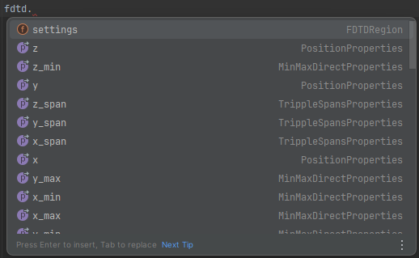
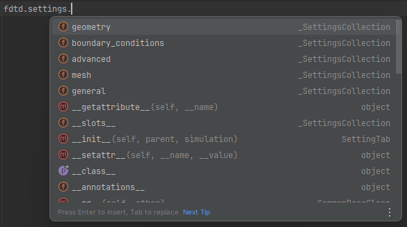
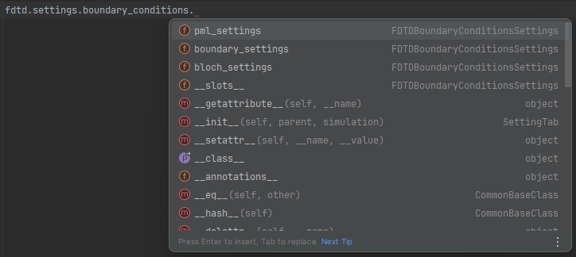
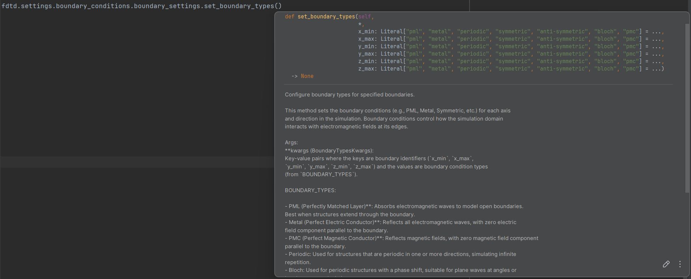
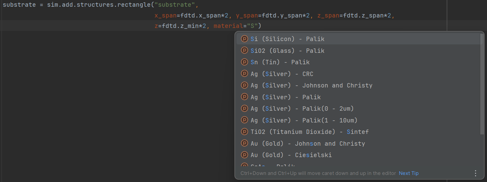
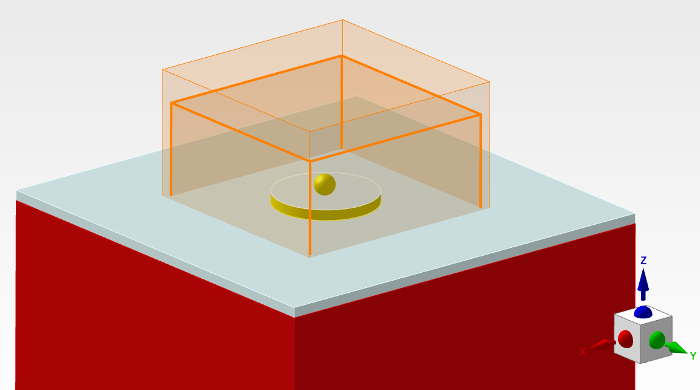
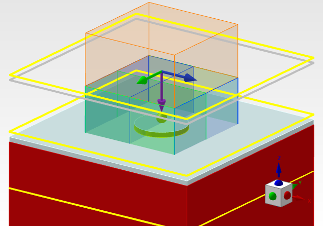
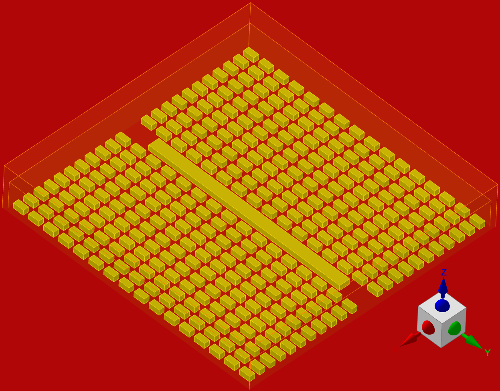
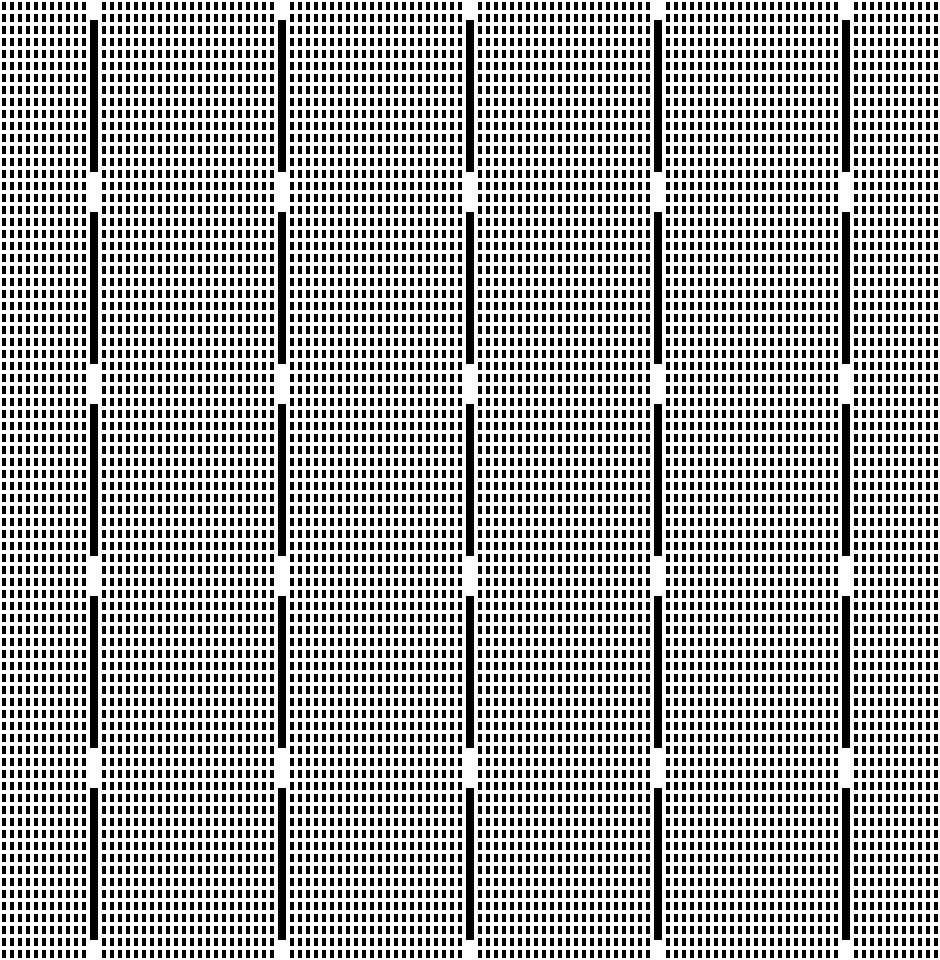

# FDTDream

`FDTDream` is a Python framework for creating, manipulating, and extracting data from Lumerical FDTD simulation files. 

## Prerequisites

- A valid license for `Lumerical FDTD`.
- `Lumerical FDTD` installed on your computer.
- Python packages listed in `requisites.txt` installed.
- Correctly configured path to the Lumerical Python API (`lumapi.py`). This is usually found in a default directory, 
but you may need to update the path if the code does not work.

## Initial Setup

1.  **Verify lumapi.py Import:**

    Ensure that you are importing `lumapi.py` from the correct directory. In the `Code/Resources/lumapi_import.py` file, 
    you will find the following code snippet:

    ```python
    import importlib.util
    
    # Where the lumerical python API is located. Change this to the location on your computer.
    lumapi_location = r'C:\\Program Files\\Lumerical\\v241\\api\\python\\lumapi.py'
    
    spec_win = importlib.util.spec_from_file_location(name='lumapi', location=lumapi_location)
    lumapi = importlib.util.module_from_spec(spec_win)
    spec_win.loader.exec_module(lumapi)
    ```

    If you can't run the code initially, Your lumapi.py file is probably located elsewhere. With different FDTD 
    releases, the `\v241\` subfolder could be named differently, so try locating your `lumapi.py`-file and change the 
    `lumapi_location` variable in the code snippet above.


2.  **Install required python packages:**

    Ensure that you have the required Python packages installed. From the Python console in you IDE you should just be 
    able to run the command:
    ```
    pip install -r requirements.txt
    ```
    which will install all of them at once. If this doesn't work, you can run a pip install command for each one of the 
    packages in the `requirements.txt` file separately in the python console.

## Importing modules

First you need to import the `FDTDream` module from `fdtdream.py`. 
```python
from fdtdream import FDTDream
```

# Creating a new simulation file

To create a new `.fsp`-file:
```python
sim = FDTDream.new_file("name_of_the_file")
```

When you run the code, a file-explorer window will pop up and let you choose a location to save the new file. Simple as
that. In some cases you might want to create a new file with the same name saved to the same location many times, say if
you're trying out different code to get a simulation just right. In that case it may be a bit annoying to deal with the 
file-explorer every time you run your code. Whenever you create a new file like this, the console will print
the function with your full path, like this:

```txt
Replace the FDTDream.new_file() method with this if you want to save the new file to the same location next time you run the function.

sim = FDTDream.new_file('name_of_the_file',
                        save_path='C:/Users/mgnso/Desktop/FDTDSim_tests/name_of_the_file.fsp',
                        units='nm', hide=False, simulation_variable_name='sim')
```
Now you can copy/paste this into your code so it looks like this:
```python
from fdtdream import FDTDream

sim = FDTDream.new_file('name_of_the_file',
                        save_path='C:/Users/mgnso/Desktop/FDTDSim_tests/name_of_the_file.fsp',
                        units='nm', hide=False, simulation_variable_name='sim')
```
But what are these other arguments? They are all optional, but could be usefull depending on your application. 
`units` defines what length units numbers will be in. You can choose between "m", "cm", "mm", "um", "nm", "angstrom", 
and "fm". The default value is nanometers. ``hide`` is a boolean parameter, which if ``True`` will allow your code to 
run in the background. If it's ``False``, the FDTD-application will open, and you can see everything that's going on.
``simulation_variable_name`` is a string that should be whatever you call your simulation variable. In this case it is 
``"sim"``. It doesn't need to be that, but it is recomended. The default value is always ``sim``, so if you use another 
name, you should set ``simulation_variable_name`` to this. Why? It will be clear when we move on to loading 
simulation files.

To ``save`` the simulation file you simply call:
```python
sim.save()
```

# Finding settings, functions, and properties

I have tried to group all settings and menus in the same way as in the FDTD-application. 
Menus can be accessed by placing a ``.`` after the variable. Sub-menus, functions and properties will then show up as 
auto-complete options, like this:
<div>
  
</div>
<div>
  
</div>
<div>
  
</div>

Sometimes variables and function I have meant not to be accesible to the end-user shows up, along with the double-
underscore methods. I would like to avoid this, but regrettably it's nothing I can do about it (as far as I know).
As a rule of thumb, if an autocomplete options has ``_`` or ``__`` in front of it, pretend you never saw it.

I have tried to add proper documentation to all methods, not only how they work, but also what the parameters mean. 
I have taken a lot of info from Ansys' web page. For example, the image below shows parts of the docstring for the 
``set_boundary_types()`` method, which explains what the different boundary types mean. If you are confused as to what
a function does or what a parameter really means, try hovering the mouse over the function to read the docstring.



# Creating simulation objects

All objects are created through the simulation variable, ``sim`` in this case. Methods for adding thing can be found
under the ``add``-menu. Let's start by adding an FDTD-Region to our simulation
```python
fdtd = sim.add.simulation.fdtd_region()
```
This will add an FDTD-region with the default settings, just like it would be in the FDTD-application. The adding
method have some keyword arguments that are listed in the documentation of the method. You can set parameters like
position and spans already in the adding method, like this:
```python
fdtd = sim.add.simulation.fdtd_region(x_span=2000, y_span=2000, z_span=2000)
```
Or you can do it using the geometry settings after the object has been created, like this:
```python
fdtd.settings.geometry.set_spans(x_span=2000, y_span=2000, z_span=2000)
```
Or you could do it through the object's properties, like this:
```python
fdtd.x_span = 2000
fdtd.y_span = 2000
fdtd.z_span = 2000
```
It can be usefull to note that the object's properties support the ``+=``, ``-=``, ``*=``. ``/=`` operators, 
so if you want to say increment the x-span of an object by 25 nanometers, you can simply do it like this:
```python
fdtd.x_span += 25
```
Let's add a silicon substrate that extends well beyond the FDTD-region. We'll place it so that the surface 
is at the z=0 coordinate.
```python
substrate = sim.add.structures.rectangle("substrate",
                                         x_span=fdtd.x_span*2, y_span=fdtd.y_span*2, z_span=fdtd.z_span*2,
                                         z=fdtd.z_min*2, material="Si (Silicon) - Palik")
```

Here, all the arguments are optional, except for the ``first one``, which is the ``name`` of the object you're creating.
This name has to be unique, and if it isn't, an error explaining this will be raised. Every object requires a unique 
name as the first argument, except the FDTD-region, which will always be named "fdtd" by default.
The ```material``` parameter takes in the name of your material. It is linked to a ``typing.Literal`` object 
with a list of all default materials, so you will get autocompletion when you start writing (see image below). 
Again, possible keyword arguments are listed in the method's documentation.



Now we can add stuff on top of the substrate. Let's use the ``add.layer`` menu to add a 100 nm glass film on top
of the substrate.
```python
glass_film = sim.add.layer.on_rectangle(substrate, "glass film", 100, "SiO2 (Glass) - Palik")
```
This method takes in a rectangle object as it's first argument. This is the structure you want to add a layer to.
The next argument is the name of the layer you're creating. The number is the thickness of the layer, and the last 
argument is the material.

Now, let's add a circular gold disc resonator on top of the glass film. 
```python
disc_res = sim.add.structures.circle("disc resonator", radius=500, z_span=100, material="Au (Gold) - CRC")
disc_res.place_on_top_of(glass_film)
```
Using the ``place_on_top_of()`` method you can simply put objects on top of other objects.

Let's turn this into a nanoparticle-on-disc-resonator type structure. In that case we need a thin film between the 
disc resonator and the nanoparticle. Again, using the ``add.layer``-menu, we can add a 2 nm circular layer of glass 
on top of the resonator.
```python
sep_layer = sim.add.layer.on_circle(disc_res, "separation layer", 2, "SiO2 (Glass) - Palik")
```
Now, let's add a gold nanoparticle with a radius of 100 nm.
```python
np = sim.add.structures.sphere("nanoparticle", radius=100, material="Au (Gold) - CRC")
np.place_on_top_of(sep_layer)
```
We can offset the position of the nanoparticle so that it's not in the center of the resonator. We can do this by using 
the objects properties as before, or we can set the position using the ``settings.geometry``-menu. Here there are 
methods for settings spans and position. Position can be set with cartesian, cyllindrical, and spherical coordinates.
Let's do it with cyllindrical coordinates, just to show that it's possible.
```python
np.settings.geometry.set_position_cylindrically(disc_res, 45, 100)
```
The first argument is the position that acts as the origin. It is (0, 0) by defualt, but you could set a custom one
using a tuple, ie. (2, 2), or by passing an object. If an object is passed, it's position will act as the origin.
Here we have passed the disc resonator as the origin. The next argument is the angle theta, and the last is the distance
from the origin. You can also have a ``z``-parameter, which set the displacement in the z-axis. This defaults to 0.
Again, explanations of parameters are found in the method's documentation, accesible by hovering the mouse over the 
method. 

Now we can run this and see how it looks like.



The full code at this point is:
```python
from fdtdream import FDTDream

sim = FDTDream.new_file('name_of_the_file',
                        save_path='C:/Users/mgnso/Desktop/FDTDSim_tests/name_of_the_file.fsp',
                        units='nm', hide=False, simulation_variable_name='sim')

# Add fdtd-region
fdtd = sim.add.simulation.fdtd_region(x_span=2000, y_span=2000, z_span=2000)

# Add substrate
substrate = sim.add.structures.rectangle("substrate",
                                         x_span=fdtd.x_span*2, y_span=fdtd.y_span*2, z_span=fdtd.z_span*2,
                                         z=fdtd.z_min*2, material="Si (Silicon) - Palik")
# Add 100 nm glass film
glass_film = sim.add.layer.on_rectangle(substrate, "glass film", 100, "SiO2 (Glass) - Palik")

# Add gold disc resonator
disc_res = sim.add.structures.circle("disc resonator", radius=500, z_span=100, material="Au (Gold) - CRC")
disc_res.place_on_top_of(glass_film)

# Add 2 nm glass separation layer
sep_layer = sim.add.layer.on_circle(disc_res, "separation layer", 2, "SiO2 (Glass) - Palik")

# Add gold nanoparticle
np = sim.add.structures.sphere("nanoparticle", radius=100, material="Au (Gold) - CRC")
np.place_on_top_of(sep_layer)
np.settings.geometry.set_position_cylindrically(disc_res, 45, 100)

# Save simulation
sim.save()
```

# Loading a simulation file

If you have a .fsp file that you would like to modify using FDTDream, you can easily do this. To load a file, you
call the ``FDTDream.load_file()`` method. It has the same optional parameters as the ``FDTDream.new_file()`` method.
When loading for the first time, you don't need to specify a file_path. As before, an explorer window opens.
For exapmle, you can simply call:
```python
sim = FDTDream.load_file(units="nm", hide=True)
```
Let's say we want to load the file we previously made. At this point, run the code and select the .fsp file in the 
file-explorer. The program will analyze the simulation file and create objects based on it's contents. After the 
analysis is finished, variable declarations will be printed to the console, and the program is terminated. The console
will look like this:
```text
Copy/paste these into your code, replacing the simulation initialization. 
This yields full autocompletion for every object present in the loaded simulation file.


#BEGINNING OF VARIABLE DECLARATIONS=================================================================================
sim = FDTDream.load_file(file_path='C:/Users/mgnso/Desktop/FDTDSim_tests/name_of_the_file.fsp',
                         units='nm', hide=True, simulation_variable_name='sim')
fdtd: sim.object_interfaces.FDTDRegionInterface = sim.__getattribute__('_fdtd')  # type: ignore
substrate: sim.object_interfaces.RectangleInterface = sim.substrate  # type: ignore
glass_film: sim.object_interfaces.RectangleInterface = sim.glass_film  # type: ignore
disc_resonator: sim.object_interfaces.CircleInterface = sim.disc_resonator  # type: ignore
separation_layer: sim.object_interfaces.CircleInterface = sim.separation_layer  # type: ignore
nanoparticle: sim.object_interfaces.SphereInterface = sim.nanoparticle  # type: ignore
#END OF VARIABLE DECLARATIONS=======================================================================================
```

Pasting this into our code gives us the ability to manipulate objects just as in the case where we made them from 
scratch.

```python
from fdtdream import FDTDream

# BEGINNING OF VARIABLE DECLARATIONS=================================================================================
sim = FDTDream.load_file(file_path='C:/Users/mgnso/Desktop/FDTDSim_tests/name_of_the_file.fsp',
                         units='nm', hide=True, simulation_variable_name='sim')
fdtd: sim.object_interfaces.FDTDRegionInterface = sim.__getattribute__('_fdtd')  # type: ignore
substrate: sim.object_interfaces.RectangleInterface = sim.substrate  # type: ignore
glass_film: sim.object_interfaces.RectangleInterface = sim.sio2_film  # type: ignore
disc_resonator: sim.object_interfaces.CircleInterface = sim.disc  # type: ignore
separation_layer: sim.object_interfaces.CircleInterface = sim.separation_layer  # type: ignore
nanoparticle: sim.object_interfaces.SphereInterface = sim.np  # type: ignore
# END OF VARIABLE DECLARATIONS=======================================================================================
```
Just from the variable declarations you can see what kind of objects there are. Ie. the glass film has the type
``RectangleInterface``, so it's a rectangle structure.

To start of, we can place the nanoparticle back into the center of the disc resonator, apply symmetric/anti-symmetric
boundaries to the fdtd-region, and change the number of layers for the z-min and z-max PML boundaries.
```python
# Set the position of the nanoparticle
nanoparticle.settings.geometry.set_position(x=disc_resonator.x, y=disc_resonator.y)

# Apply symemtric boundary conditions
fdtd.settings.boundary_conditions.boundary_settings.set_boundary_types(
    x_min="symmetric", x_max="symmetric", y_min="anti-symmetric", y_max="anti-symmetric")

# Change the number of PML layers
fdtd.settings.boundary_conditions.pml_settings.set_layers(z_min=20, z_max=25)
```

Now we'll add a plane wave source, injecting along the z-axis in the negative direction. We will place it 800 nm 
above the top of the nanoparticle (just as an illustration).
```python
source = sim.add.sources.plane_wave("source", "z-axis", "backward", x_span=substrate.x_span, y_span=substrate.y_span,
                                    z=nanoparticle.z_max + 800)
```
The first two arguments after the name are the ``injection axis`` and the ``direction``. The rest are optional.

We can set the source bandwidth from 400 nm to 1000 nm either by setting the global source limits,
```python
sim.global_source_settings.set_wavelength_start_and_stop(400, 1000)
```
or by overriding the global source settings and applying the settings directly to the source object:
```python
source.settings.freq_and_wavelength.override_global_source_settings(True)
source.settings.freq_and_wavelength.set_wavelength_start_and_stop(400, 1000)
```
Now we can add monitors. We'll start by adding a reflection power monitor 100 nm above the source.
```python
ref_power = sim.add.monitors.power_monitor("reflection monitor", "2d z-normal", x_span=substrate.x_span,
                                           y_span=substrate.y_span, z=source.z + 100)
```
We can set the type of data it should record by doing:
```python
ref_power.settings.data_to_record.set_data_to_record(disable_all_first=True, power=True)
```
The ``disable_all_first`` argument disables all the options before the changes you make are applied. This is so you 
shouldn't have to manually disable all but one. The other way around, ``enable_all_first`` can also be passed. Now we
have a power monitor that only records output power. 

Let's add a transmission power monitor. We will place it the 
same distance from the separation layer as the reflection monitor, only on the other side. Since this monitor 
will have the excact same settings and dimensions as the other one, we can use the ```functions.copy()``` method
to copy it.
```python
trans_power = sim.functions.copy(ref_power, "transmission monitor", 
                                 z=separation_layer.z - (ref_power.z - separation_layer.z))
```

Now we'll add a profile monitor in the middle of the separation layer. Either you can add a new profile monitor 
from scratch, like this:
```python
profile = sim.add.monitors.profile_monitor("profile monitor", "2d z-normal", x_span=substrate.x_span, 
                                           y_span=substrate.y_span, z=separation_layer.z)
```
Or you could copy one of the power monitors and use the ``make_profile_monitor()`` method, like this:
```python
profile = sim.functions.copy(trans_power, "profile monitor", z=separation_layer.z)
profile.make_profile_monitor()
```

Now we'll set what data to record. Here we want to record the electric and magnetic field vectors.
```python
profile.settings.data_to_record.set_data_to_record(power=False, ex=True, ey=True, ez=True, hx=True, hy=True, hz=True)
```

When running the code, you will get this warning:
```text
C:\Users\mgnso\Desktop\Master thesis\Code\FDTDream\Code\fdtd_region.py:1182: UserWarning: 
Method: set_layers
The following values accepted by the simulation enviroment differs from the input values:
	z_max: input value=25, accepted value=26

  warnings.warn(warning)
```
This warning will not terminate the code, but let's you know that when we set the PML layers of the z-max boundary,
the FDTD-simulation automatically set it to a different value. This sometimes happens, and when it does, also for other
variables you set, a similar warning will be issued.

After running the code, the simulation enviroment looks like this:
<div>
  
</div>

The full code is as follows:

```python
from fdtdream import FDTDream

# BEGINNING OF VARIABLE DECLARATIONS=================================================================================
sim = FDTDream.load_file(file_path='C:/Users/mgnso/Desktop/FDTDSim_tests/name_of_the_file.fsp',
                         units='nm', hide=True, simulation_variable_name='sim')
fdtd: sim.object_interfaces.FDTDRegionInterface = sim.__getattribute__('_fdtd')  # type: ignore
substrate: sim.object_interfaces.RectangleInterface = sim.substrate  # type: ignore
glass_film: sim.object_interfaces.RectangleInterface = sim.sio2_film  # type: ignore
disc_resonator: sim.object_interfaces.CircleInterface = sim.disc  # type: ignore
separation_layer: sim.object_interfaces.CircleInterface = sim.separation_layer  # type: ignore
nanoparticle: sim.object_interfaces.SphereInterface = sim.np  # type: ignore
# END OF VARIABLE DECLARATIONS=======================================================================================

# Set the position of the nanoparticle
nanoparticle.settings.geometry.set_position(x=disc_resonator.x, y=disc_resonator.y)

# Apply symemtric boundary conditions
fdtd.settings.boundary_conditions.boundary_settings.set_boundary_types(
    x_min="symmetric", x_max="symmetric", y_min="anti-symmetric", y_max="anti-symmetric")

# Change the number of layers
fdtd.settings.boundary_conditions.pml_settings.set_layers(z_min=20, z_max=25)

# Add a plane wave source
source = sim.add.sources.plane_wave("source", "z-axis", "backward", x_span=substrate.x_span, y_span=substrate.y_span,
                                    z=nanoparticle.z_max + 800)
sim.global_source_settings.set_wavelength_start_and_stop(400, 1000)

# Add reflection power monitor
ref_power = sim.add.monitors.power_monitor("reflection monitor", "2d z-normal", x_span=substrate.x_span,
                                           y_span=substrate.y_span, z=source.z + 100)
ref_power.settings.data_to_record.set_data_to_record(disable_all_first=True, power=True)

# Add transmission power monitor
trans_power = sim.functions.copy(ref_power, "transmission monitor",
                                 z=separation_layer.z - (ref_power.z - separation_layer.z))

# Add a profile monitor
profile = sim.functions.copy(trans_power, "profile monitor", z=separation_layer.z)
profile.settings.data_to_record.set_data_to_record(power=False, ex=True, ey=True, ez=True,
                                                   hx=True, hy=True, hz=True)
profile.make_profile_monitor()

# Save the simulation
sim.save()
```

# Loading file as base
Sometimes you might want to define a base simulation enviroment that you can manipulate again and again
without the base enviroment changing. If we were to run the code above more than one time consecutively,
we would get errors, as the objects we are adding already exists in the simulation, since we've saved it. 
To avoid this, you can use the ``load_file_as_base()`` method from the ``FDTDream`` class. It works exactly like
before, but now it will promt you to both specify what file you want to load from, and what location you want to save
to. Taking the file we just created as an example, after loading as before we are left with variable declarations like
this:

```python
# BEGINNING OF VARIABLE DECLARATIONS=================================================================================
sim = FDTDream.load_file_as_base(load_path='C:/Users/mgnso/Desktop/FDTDSim_tests/name_of_the_file.fsp',
                                 save_path='C:/Users/mgnso/Desktop/FDTDSim_tests/new.fsp',
                                 units='nm', hide=True, simulation_variable_name='sim')
fdtd: sim.object_interfaces.FDTDRegionInterface = sim.__getattribute__('_fdtd')  # type: ignore
substrate: sim.object_interfaces.RectangleInterface = sim.substrate  # type: ignore
glass_film: sim.object_interfaces.RectangleInterface = sim.sio2_film  # type: ignore
disc_resonator: sim.object_interfaces.CircleInterface = sim.disc  # type: ignore
separation_layer: sim.object_interfaces.CircleInterface = sim.separation_layer  # type: ignore
nanoparticle: sim.object_interfaces.SphereInterface = sim.np  # type: ignore
source: sim.object_interfaces.PlaneWaveSourceInterface = sim.source  # type: ignore
reflection_monitor: sim.object_interfaces.FreqDomainFieldAndPowerInterface = sim.reflection_monitor  # type: ignore
transmission_monitor: sim.object_interfaces.FreqDomainFieldAndPowerInterface = (
    sim.transmission_monitor)  # type: ignore
profile_monitor: sim.object_interfaces.FreqDomainFieldAndPowerInterface = sim.profile_monitor  # type: ignore
# END OF VARIABLE DECLARATIONS=======================================================================================
```
As you can see, the load- and save-path are different, meaning the base file won't be overwritten.
This approach is very nice if you want to run simulations and sweeps. Say you want to investigate what effect 
offsetting the nanoparticle from the resonator center has, you could do:
```python
for i in range(5):
    nanoparticle.x += 25 * i
    sim.run()
```

**NB! Running simulations are currently not supported.
Functions for running simulations, together with a searchable database for storing simulation results and a GUI for
easy access to these are almost finished. I will implement this fully after I'm done with my exam period at school. 
The previous example is therefore currently not possible, but will soon be.**

# Exporting bitmaps and GDSII files.
The FDTDream framework can take in any .fsp file, analyze it's contents, and create bitmaps and GDSII files based
on the existing structures. To demonstrate this, we can create a simulation geometry with some interesting shapes. 
The code:

```python
from fdtdream import FDTDream

# Create new .fsp file
sim = FDTDream.new_file("complex_geometry")

# FDTD-region
fdtd = sim.add.simulation.fdtd_region(x_span=4800, y_span=4800, z_span=1000)

# Add substrate
substrate = sim.add.structures.substrate("substrate", "Si (Silicon) - Palik")

# Add large gold bar, place on substrate
bar = sim.add.structures.rectangle("bar", x_span=200, y_span=3800, z_span=100,
                                   material="Au (Gold) - CRC")
bar.place_on_top_of(substrate)

# Add a grid, define grid structures, place on substrate
grid = sim.add.grids.rectangular("right grid", pitch_x=100, pitch_y=100)
grid.set_structure.rectangle(x_span=100, y_span=200, z_span=100,
                             material="Au (Gold) - CRC")
grid.place_on_top_of(substrate)

# Calc. space on right side of bar, calc. nr. of rows and cols in grid
space = fdtd.x_max - bar.x_max
grid.set_rows_and_cols(rows=fdtd.y_span//grid.unit_cell_y,
                       cols=space//grid.unit_cell_x)

# Place grid next to bar and align it and FDTD to preserve periodicity
grid.place_next_to(bar, "x_max", offset=grid.pitch_x)
fdtd.x_span = grid.x_max * 2 + grid.pitch_x

# Copy grid and place on left side of bar
grid_2 = sim.functions.copy(grid, "left grid", x=-grid.x)

# Create bitmap
sim.utilities.create_bmp_and_gds_of_crosssection("complex_geometry", z=grid.z,
                                                 pixelsize=25, rows=5, columns=5,
                                                 gds=False)
# Save simulation
sim.save()
```
will yield this geometry:


And this bitmap:




