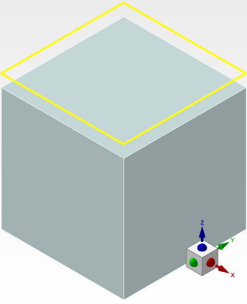

# Object Basics

FDTDream provides a variety of object types, most of which share common functionality. Understanding how these objects are created and managed is essential for effectively working with FDTDream simulations.

## Constructor Methods 🛠️

Objects in FDTDream can be created in several ways:

1. **Constructor methods in the `sim.add` module**: These methods allow for the direct creation of objects in the simulation.
2. **Constructor methods in the `add` module of a structure group object**: These methods allow for creating objects within a specific structure group.
3. **Using an object's `copy()` method**: This creates a new object that is a copy of an existing one.

### Creating Objects ✨

Most constructor methods (except for the one creating the FDTD Region) require only one argument: the name of the object. If the object is not part of a structure group, its name must be unique; otherwise, errors will be raised.

Additionally, each constructor method accepts a set of keyword arguments that allow for customization. These arguments are listed in the method’s documentation. Below is an example of creating a substrate and a power monitor, where all parameters are set using the constructor method.

```python
substrate = sim.add.structures.rectangle("substrate", x_span=1000, y_span=1000, z_span=1000, z=-1000 / 2,
                                         material="SiO2 (Glass) - Palik")
monitor = sim.add.monitors.ref_power("power", monitor_type="2d z-normal", x_span=substrate.x_span,
                                     y_span=substrate.y_span,
                                     z=100, data_to_record=["power", "ex", "ey", "ez"])
```

This yields the following simulation environment:



## Shared Properties 🔧

All FDTDream objects share a set of properties and methods, as well as the `settings` module that contains sub-settings for the given object type. The `settings.geometry` module is very similar for all objects and is described in the Geometry module file.

### Properties 🏠

The following properties are shared by all object types:

1. **`x`**: Returns/sets the x-coordinate in the object's own coordinate system. Allows `+=`, `-=`, `*=`, `/=` operations.
2. **`y`**: Returns/sets the y-coordinate in the object's own coordinate system. Allows `+=`, `-=`, `*=`, `/=` operations.
3. **`z`**: Returns/sets the z-coordinate in the object's own coordinate system. Allows `+=`, `-=`, `*=`, `/=` operations.
4. **`pos`**: Returns the position vector of the object as a 3-element tuple. Position is in the object's own coordinate system. Also sets the position if assigned a 3-element tuple, i.e. `obj.pos = (10, 10, 10)`.
5. **`name`**: Returns the name of the object as a string. Cannot be set after the object is created.
6. **`enabled`**: Returns/sets the object's enabled state. True or False.

### Methods 🛠️

The following methods are shared by all object types:

1. **`span(axis)`**: Given either "x", "y", or "z", returns the distance between the minimum and maximum point of the object along that axis.
2. **`min(axis)`**: Given "x", "y", or "z", returns the minimum coordinate of the object along that axis.
3. **`max(axis)`**: Given "x", "y", or "z", returns the maximum coordinate of the object along that axis.
4. **`place_next_to(object, boundary, offset)`**:  Places the object next to the specified boundary of another object.

   The object will be placed so that the opposite side touches the side specified of the other object. The offset specifies a distance the object is moved from this position along the specified axis. The objects will be placed next to each other even if they have different coordinate systems; however, if the coordinate systems are rotated with respect to each other, this method might not work properly. Returns a reference to the same method, allowing you to stack this method.

   > **NB!** Only the coordinate for the specified axis will be changed. If the two objects don't share any common axis, they won't touch if you place it next to the other object's axis. For example, if you place an object next to the other object’s `y_max`, their `y_max` and `y_min` coordinates will be the same.

5. **`copy(name)`**: Given a new unique name, returns an exact copy of the original object. Accepts the same set of keyword arguments as the object type's original constructor method.
